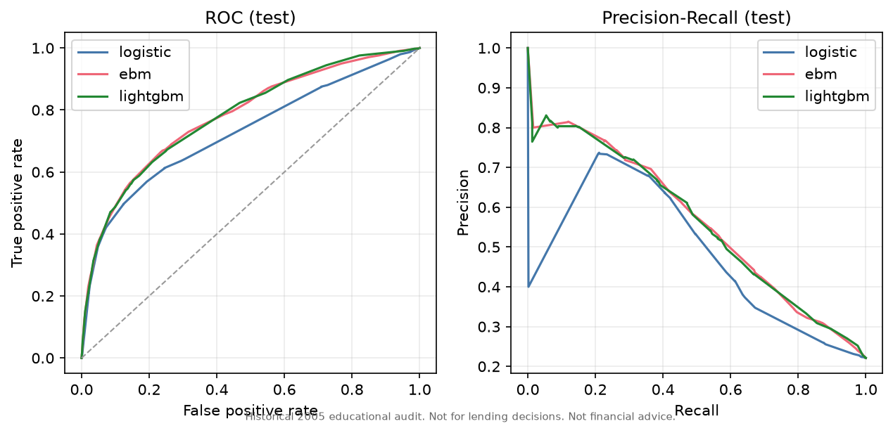
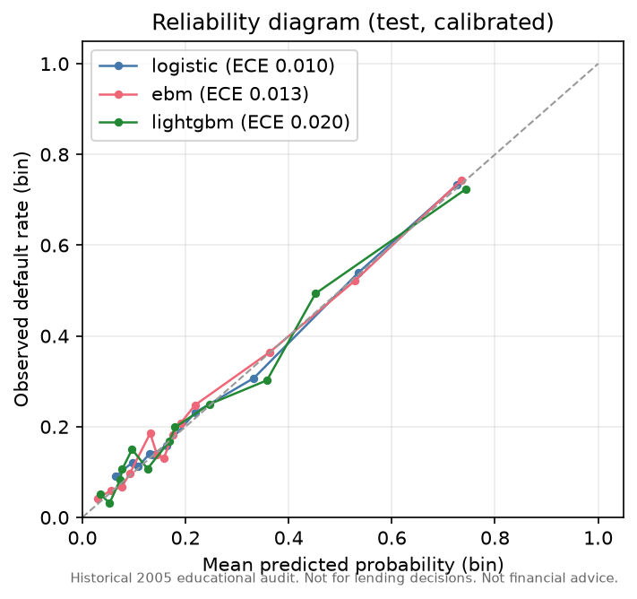
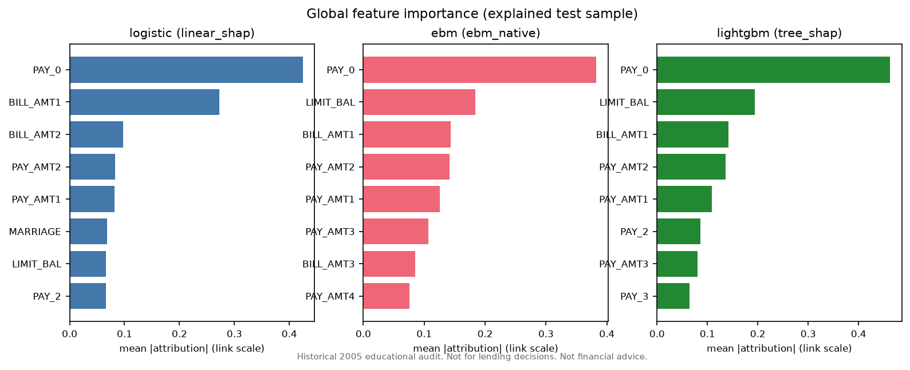
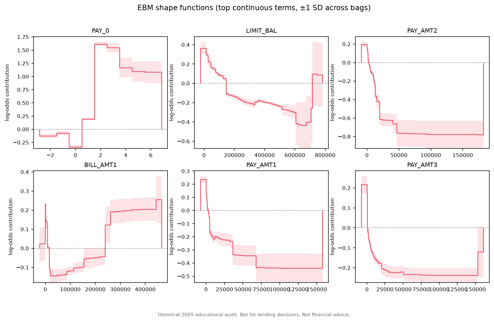
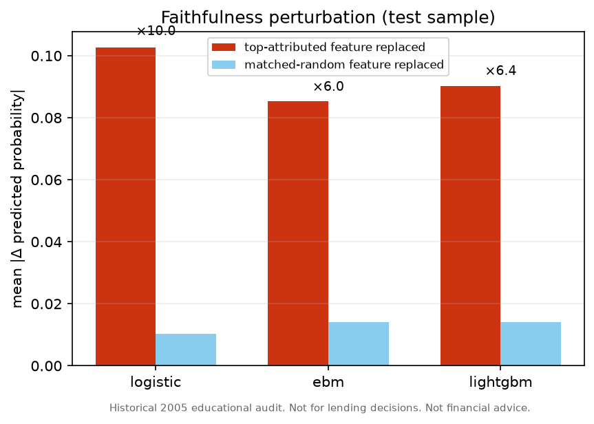
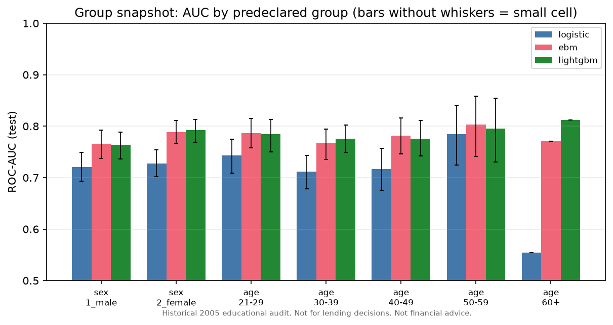

# credit-xai-audit（繁體中文）

> **Historical 2005 educational audit. Not for lending decisions. Not financial advice.**
> （2005 年歷史資料之教育用途稽核。不得用於授信決策。非財務建議。）

本專案是對 [UCI Default of Credit Card Clients](https://archive.ics.uci.edu/dataset/350/default+of+credit+card+clients)
資料集（台灣，2005 年，30,000 筆、23 個特徵）進行的教育用途、可完整重現的
可解釋性（XAI）稽核。三個模型家族 — logistic regression、Explainable Boosting
Machine（EBM）、LightGBM — 依序完成訓練、機率校準與稽核：

- **機率品質**：ROC-AUC、PR-AUC、log loss、Brier、ECE、latency，皆附 95%
  bootstrap 信賴區間；
- **解釋穩定性**：bootstrap top-k 排名穩定性與固定案例的 local attribution 穩定性；
- **解釋忠實度（faithfulness）**：top-attributed 特徵替換 vs matched-random 替換；
- **族群指標快照**：依 SEX 與預先宣告的年齡分箱，僅作描述性報告。

本專案**不做因果宣稱**、**不做歧視認定**，也**不提供任何取得授信的建議**。
它是在 20 年前公開資料上的方法展示。以下所有數字皆由
[`results/derived/summary.json`](results/derived/summary.json) 經
`python -m credit_xai.cli report` 自動產生，絕不手動編輯。English version:
[README.md](README.md).

## 結果

### 測試集指標

<!-- AUTOGEN:METRICS:START -->
<!-- generated by `credit-xai report` from results/derived/summary.json (run: full / config 187eaca76743); do not edit by hand -->
Test-set metrics, calibrated model (mean and 95% bootstrap CI over 1000 stratified replicates; run: `full`).

| Metric | logistic | ebm | lightgbm |
|---|---|---|---|
| ROC-AUC | 0.726 [0.707, 0.745] | 0.780 [0.764, 0.796] | 0.781 [0.764, 0.798] |
| PR-AUC | 0.490 [0.461, 0.516] | 0.547 [0.519, 0.574] | 0.540 [0.511, 0.568] |
| Log loss | 0.454 [0.440, 0.468] | 0.430 [0.418, 0.443] | 0.441 [0.424, 0.461] |
| Brier | 0.140 [0.136, 0.145] | 0.134 [0.129, 0.139] | 0.135 [0.130, 0.139] |
| ECE | 0.016 [0.009, 0.025] | 0.020 [0.013, 0.028] | 0.024 [0.016, 0.034] |
| Latency (median) | 5.39 ms/row · 2.0 ms/1k | 1.57 ms/row · 1.9 ms/1k | 5.48 ms/row · 10.6 ms/1k |
<!-- AUTOGEN:METRICS:END -->



### 機率校準

校準方法（Platt sigmoid / isotonic）只用 validation set 選擇（validation log
loss），test set 完全不參與選擇；決策 threshold 亦於 validation 凍結。

<!-- AUTOGEN:CALIBRATION:START -->
<!-- generated by `credit-xai report` from results/derived/summary.json (run: full / config 187eaca76743); do not edit by hand -->
Calibration method selected on validation log loss only; the test set never participates in selection.

| Model | Val log loss (sigmoid) | Val log loss (isotonic) | Selected | Test ECE uncal → cal | Threshold* |
|---|---|---|---|---|---|
| logistic | 0.4594 | 0.4405 | **isotonic** | 0.0571 → 0.0098 | 0.218 |
| ebm | 0.4303 | 0.4253 | **isotonic** | 0.0152 → 0.0131 | 0.339 |
| lightgbm | 0.4274 | 0.4206 | **isotonic** | 0.0208 → 0.0203 | 0.354 |

\* Threshold = validation-quantile at (1 − validation base rate), frozen before test evaluation.
<!-- AUTOGEN:CALIBRATION:END -->



### 可解釋性

每個模型使用其類別對應的精確／解析式歸因方法：LightGBM 用 TreeSHAP、logistic
regression 用精確 linear SHAP（one-hot 歸因加總回母特徵）、EBM 用其原生的可加
term 貢獻。跨模型只做定性比較，不做數值比較。

<!-- AUTOGEN:XAI:START -->
<!-- generated by `credit-xai report` from results/derived/summary.json (run: full / config 187eaca76743); do not edit by hand -->
**Global top-5 features** (mean |attribution| on the explained test sample):

| Rank | logistic | ebm | lightgbm |
|---|---|---|---|
| 1 | PAY_0 | PAY_0 | PAY_0 |
| 2 | BILL_AMT1 | LIMIT_BAL | LIMIT_BAL |
| 3 | BILL_AMT2 | BILL_AMT1 | BILL_AMT1 |
| 4 | PAY_AMT2 | PAY_AMT2 | PAY_AMT2 |
| 5 | PAY_AMT1 | PAY_AMT1 | PAY_AMT1 |

**Explanation stability** (top-k Jaccard vs the full-data reference; `refit` = model refit on bootstrap resamples of train, `resample` = explanation-sample resampling only):

| Model | Method | Jaccard (refit) | Kendall τ (refit) | Jaccard (resample) | Sign consistency (local, top-5) | Spearman ρ (local) |
|---|---|---|---|---|---|---|
| logistic | linear_shap | 0.634 [0.429, 0.914] | 0.614 [0.446, 0.783] | 1.000 [1.000, 1.000] | 0.961 | 0.837 |
| ebm | ebm_native | 0.612 [0.429, 0.746] | 0.498 [0.390, 0.593] | 0.923 [0.818, 1.000] | 0.930 | 0.500 |
| lightgbm | tree_shap | 0.763 [0.538, 1.000] | 0.743 [0.656, 0.850] | 0.938 [0.818, 1.000] | 0.979 | 0.614 |

**Faithfulness perturbation** (mean |Δ probability| when replacing the top-attributed vs a matched-random feature with validation donor values; ratio > 1 supports faithfulness; sanity check, not causal evidence):

| Model | Δ top | Δ random | Ratio [CI] | n |
|---|---|---|---|---|
| logistic | 0.1026 | 0.0103 | 9.95 [9.32, 10.63] | 2000 |
| ebm | 0.0853 | 0.0142 | 6.02 [5.65, 6.43] | 2000 |
| lightgbm | 0.0902 | 0.0141 | 6.40 [5.97, 6.88] | 2000 |
<!-- AUTOGEN:XAI:END -->







### 族群指標快照

以下為模型在 2005 年歷史資料上行為的描述性快照（凍結 threshold 下計算），
不構成對任何個人或授信實務的結論；小樣本格的信賴區間予以抑制。

<!-- AUTOGEN:GROUPS:START -->
<!-- generated by `credit-xai report` from results/derived/summary.json (run: full / config 187eaca76743); do not edit by hand -->
Descriptive snapshot of model behavior on 2005 historical data, by SEX (UCI coding: 1 = male, 2 = female) and predeclared age bins, at the frozen base-rate threshold. These numbers support no conclusions about individuals or lending practices. CIs are suppressed for small cells.

**logistic**

| Group | n | AUC | FPR | FNR | Selection rate |
|---|---|---|---|---|---|
| sex=1_male | 1790 | 0.721 [0.694, 0.749] | 0.270 [0.247, 0.294] | 0.397 [0.354, 0.439] | 0.349 [0.328, 0.371] |
| sex=2_female | 2710 | 0.727 [0.701, 0.754] | 0.143 [0.129, 0.158] | 0.456 [0.413, 0.498] | 0.228 [0.214, 0.243] |
| age=21-29 | 1408 | 0.743 [0.708, 0.775] | 0.152 [0.132, 0.173] | 0.429 [0.380, 0.481] | 0.249 [0.229, 0.269] |
| age=30-39 | 1718 | 0.712 [0.678, 0.743] | 0.171 [0.152, 0.192] | 0.476 [0.424, 0.530] | 0.239 [0.221, 0.257] |
| age=40-49 | 991 | 0.717 [0.675, 0.757] | 0.238 [0.209, 0.269] | 0.415 [0.355, 0.476] | 0.325 [0.297, 0.352] |
| age=50-59 | 331 | 0.784 [0.725, 0.840] | 0.324 [0.265, 0.383] | 0.282 [0.192, 0.385] | 0.417 [0.369, 0.468] |
| age=60+ | 52 | 0.554 (small cell) | 0.378 (small cell) | 0.533 (small cell) | 0.404 (small cell) |

**ebm**

| Group | n | AUC | FPR | FNR | Selection rate |
|---|---|---|---|---|---|
| sex=1_male | 1790 | 0.766 [0.738, 0.793] | 0.160 [0.140, 0.179] | 0.449 [0.401, 0.494] | 0.252 [0.234, 0.270] |
| sex=2_female | 2710 | 0.789 [0.767, 0.811] | 0.107 [0.095, 0.120] | 0.467 [0.423, 0.507] | 0.197 [0.185, 0.211] |
| age=21-29 | 1408 | 0.786 [0.758, 0.815] | 0.129 [0.109, 0.149] | 0.451 [0.401, 0.503] | 0.226 [0.205, 0.245] |
| age=30-39 | 1718 | 0.768 [0.736, 0.795] | 0.125 [0.108, 0.143] | 0.500 [0.448, 0.561] | 0.197 [0.178, 0.215] |
| age=40-49 | 991 | 0.781 [0.746, 0.816] | 0.124 [0.101, 0.147] | 0.448 [0.383, 0.512] | 0.231 [0.208, 0.255] |
| age=50-59 | 331 | 0.803 [0.741, 0.858] | 0.150 [0.107, 0.190] | 0.346 [0.244, 0.462] | 0.269 [0.227, 0.308] |
| age=60+ | 52 | 0.770 (small cell) | 0.081 (small cell) | 0.533 (small cell) | 0.192 (small cell) |

**lightgbm**

| Group | n | AUC | FPR | FNR | Selection rate |
|---|---|---|---|---|---|
| sex=1_male | 1790 | 0.764 [0.736, 0.789] | 0.161 [0.142, 0.180] | 0.449 [0.404, 0.492] | 0.253 [0.234, 0.272] |
| sex=2_female | 2710 | 0.792 [0.769, 0.813] | 0.110 [0.097, 0.124] | 0.469 [0.429, 0.509] | 0.200 [0.187, 0.212] |
| age=21-29 | 1408 | 0.784 [0.750, 0.813] | 0.136 [0.115, 0.156] | 0.460 [0.407, 0.519] | 0.229 [0.208, 0.249] |
| age=30-39 | 1718 | 0.776 [0.749, 0.802] | 0.120 [0.103, 0.138] | 0.494 [0.442, 0.548] | 0.194 [0.178, 0.211] |
| age=40-49 | 991 | 0.776 [0.743, 0.811] | 0.124 [0.101, 0.148] | 0.452 [0.387, 0.512] | 0.230 [0.209, 0.254] |
| age=50-59 | 331 | 0.796 [0.730, 0.854] | 0.178 [0.130, 0.225] | 0.359 [0.256, 0.462] | 0.287 [0.245, 0.329] |
| age=60+ | 52 | 0.812 (small cell) | 0.135 (small cell) | 0.400 (small cell) | 0.269 (small cell) |

<!-- AUTOGEN:GROUPS:END -->



## 快速開始

需要 Python 3.11+ 與 [uv](https://docs.astral.sh/uv/)。setup 使用 non-editable
安裝，避免 Windows 非 ASCII checkout 路徑下 editable `.pth` 的 locale 解碼問題。

```bash
python scripts/setup_environment.py

uv run --no-sync python -m credit_xai.cli data prepare --config configs/smoke.yaml
uv run --no-sync python -m credit_xai.cli train --model logistic --config configs/smoke.yaml
uv run --no-sync python -m credit_xai.cli train --model ebm      --config configs/smoke.yaml
uv run --no-sync python -m credit_xai.cli train --model lightgbm --config configs/smoke.yaml
uv run --no-sync python -m credit_xai.cli calibrate --config configs/smoke.yaml
uv run --no-sync python -m credit_xai.cli evaluate  --config configs/smoke.yaml
uv run --no-sync python -m credit_xai.cli explain   --config configs/smoke.yaml
uv run --no-sync python -m credit_xai.cli report    --config configs/smoke.yaml
uv run --no-sync python -m credit_xai.cli serve     --config configs/smoke.yaml  # API + /ui
```

`configs/smoke.yaml` 在筆電 CPU 上數分鐘內完成；`configs/full.yaml` 提高所有
運算預算（1,000 bootstrap、20 refits、全 test set SHAP）；已接受的 full run
在 Colab CPU 實測約 4.5 小時，實際時間依硬體與 BLAS 而異。
長任務逐 iteration checkpoint，中斷後以 `--resume` 續跑；未帶 `--resume` 遇到
部分結果會直接報錯。全程不需 GPU。

Docker（CPU-only）：

```bash
docker compose up api                      # 於 :8000 提供 API（掛載你訓練好的 models/）
docker compose --profile smoke run smoke   # 容器內以 synthetic 資料跑完整 pipeline
```

本候選不發布 model bundle。未掛載本機訓練且 hash 驗證的 bundle 時，API health
仍可用，但 prediction/explanation endpoint 會回傳 503；有 bundle 時，輸出會明示
為歷史教育用途 model replay，不是決策或現實風險評估。

## 方法摘要

- **資料**：UCI id=350，自官方 archive 下載並以 sha256 釘住
  （`manifests/dataset_fingerprint.json`）。移除 `ID`；未文件化類別併入文件化的
  「others」（EDUCATION {0,5,6}→4、MARRIAGE {0}→3），確切筆數見
  [DATA_CARD.md](DATA_CARD.md)；PAY_* 維持 ordinal numeric。
- **切分**：stratified 70/15/15（21,000/4,500/4,500），以明確 row indices 凍結於
  `manifests/split_manifest.json`；下游只讀 manifest，絕不重切。
- **信賴區間**：test set 分層 bootstrap（保留類別數）、percentile 區間；所有
  iteration 種子由單一 root seed 衍生，可重現、可續跑，且各模型的第 i 個
  replicate 完全相同（可做 paired 比較）。
- **穩定性**：`refit` = 在 train 的 bootstrap 重抽樣上重新訓練並重算全域重要度
  （pipeline 穩定性）；`resample` = 只重抽解釋樣本列（估計噪音下限）。固定
  local 案例為預先宣告、label 分層的 validation 列。
- **忠實度**：以 validation donor 值替換 top-attributed 特徵，對照同機制下
  均勻抽取的其他特徵；報告平均 |Δp| 比值與 paired bootstrap CI。此為
  explainer-model 配對的 sanity check，非因果證據。

## 限制與使用範圍

- 資料為台灣 2005 年單一銀行信用卡組合：純屬歷史資料，不代表任何現行母體。
  **請勿**將這些模型或數字用於任何真實決策。
- 歸因數值取決於各 explainer 的假設，描述的是模型行為，不是真實世界的原因。
- 環境相容性 fallback 與偏差記錄於 [FAILURES.md](FAILURES.md)。
- 可重現性以 lockfile、種子衍生方式與相同 platform/BLAS 為界；latency 依主機而異，
  不宣稱跨作業系統 bitwise 相同。

## 發布驗證與公開邊界

候選保留精簡的機器產生證據，但排除 UCI 原始列、serialized models、環境、private
progress/handoff 資料與 private archive 的 Git history。詳見
[PUBLIC_BOUNDARY.md](docs/release/PUBLIC_BOUNDARY.md)、機器生成的
[`release_manifest.json`](manifests/release_manifest.json) 與
[VERIFICATION.md](docs/release/VERIFICATION.md)。

## 授權

程式碼採 MIT（見 [LICENSE](LICENSE)）。UCI 資料集採 CC BY 4.0：Yeh, I.
（2009），*Default of Credit Card Clients*，UCI Machine Learning Repository，
[doi:10.24432/C55S3H](https://doi.org/10.24432/C55S3H)。UCI 於 2016 年收到
此資料集，觀測資料來自 2005 年；資料集本身絕不進入本 repository 版控。
